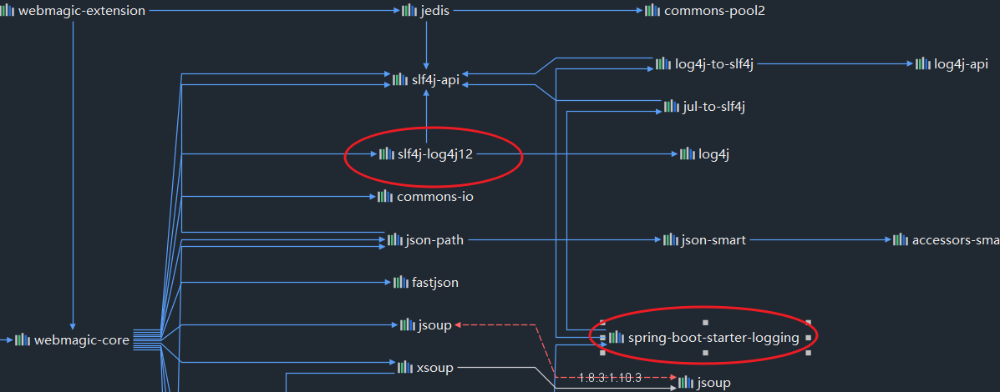

# spider1

爬虫试写

---

### 配置 log4j


webmagic 自定制的 slf4j-log4j12（是 slf4j 的实现）




默认情况下，logback 和 slf4j-log4j12 会产生冲突：

```
SLF4J: Class path contains multiple SLF4J bindings.
SLF4J: Found binding in [jar:file:/F:/MavenRepo/ch/qos/logback/logback-classic/1.2.5/logback-classic-1.2.5.jar!/org/slf4j/impl/StaticLoggerBinder.class]
SLF4J: Found binding in [jar:file:/F:/MavenRepo/org/slf4j/slf4j-log4j12/1.7.32/slf4j-log4j12-1.7.32.jar!/org/slf4j/impl/StaticLoggerBinder.class]
SLF4J: See http://www.slf4j.org/codes.html#multiple_bindings for an explanation.
SLF4J: Actual binding is of type [ch.qos.logback.classic.util.ContextSelectorStaticBinder]
```


自定制 log4j：

①排除 logback 依赖和 slf4j-log4j12

```xml
<dependency>
	<groupId>org.springframework.boot</groupId>
	<artifactId>spring-boot-starter-aop</artifactId>
	<!--排除logback依赖-->
	<exclusions>
		<exclusion>
			<groupId>ch.qos.logback</groupId>
			<artifactId>logback-classic</artifactId>
		</exclusion>
	</exclusions>
</dependency>

<dependency>
	<groupId>us.codecraft</groupId>
	<artifactId>webmagic-core</artifactId>
	<version>0.7.3</version>
</dependency>

<dependency>
	<groupId>us.codecraft</groupId>
	<artifactId>webmagic-extension</artifactId>
	<version>0.7.3</version>
	<exclusions>
		<exclusion>
			<groupId>org.slf4j</groupId>
			<artifactId>slf4j-log4j12</artifactId>
		</exclusion>
	</exclusions>
</dependency>
```

②创建 log4j.properties

```properties
# 全局日志级别设定 ,file
log4j.rootLogger=INFO, stdout, file

# 自定义包路径LOG级别
log4j.logger.org.quartz=WARN, stdout
log4j.appender.stdout=org.apache.log4j.ConsoleAppender
log4j.appender.stdout.layout=org.apache.log4j.PatternLayout
log4j.appender.stdout.layout.ConversionPattern=%d{MM-dd HH:mm:ss} >> [%p] >> [%thread] >> %m%n

# Output to the File
log4j.appender.file=org.apache.log4j.FileAppender
log4j.appender.file.File=F:/data1/webmagic.log
log4j.appender.file.layout=org.apache.log4j.PatternLayout
log4j.appender.file.layout.ConversionPattern=%d{MM-dd HH:mm:ss} >> [%p] >> [%thread] >> %C.%M() >> %m%n
```


### 对于需要滚动的页面，它的原理是JS动态加载，怎么爬取内容？

1. 使用自动化工具
2. 直接爬取网页获取的内容只有一小部分，可以手工下拉页面后保存静态页面，程序开始运行时先加载和解析页面


### 使用注解+切面统计爬虫运行时间

```java
@Record
public void startCrawl() {

    String url = "https://www.mm618.com/like";

    new MySpider(new ActualLikePageProcessor())
            //设置线程数量
            .thread(Runtime.getRuntime().availableProcessors() * 10)
            .addUrl(url)
            .run();

}
```


### 线程池的线程数量怎么设置？

IO密集型，比较不同线程下的性能：

```
文件不存在，休眠200ms，爬取下载到 f:/data1/
------------------
80线程    13s,15s,13s
8个线程   81s,68s,77s
```

IO阻塞，CPU时间浪费，增加线程以增加效率


### 集成布隆过滤器，实现URL去重

guava-BloomFilter https://blog.csdn.net/qq_43341057/article/details/120027164

参照已知的 `BloomFilterDuplicateRemover` 进行实现：

```java
public class MyBloomFilterDuplicateRemover implements DuplicateRemover {

    public MyBloomFilterDuplicateRemover(int size) {
        this(size, 0.01);
    }

    public MyBloomFilterDuplicateRemover(int size, double fpp) {
        this.size = size;
        this.fpp = fpp;
        rebuild();
    }

    private AtomicInteger counter;

    private int size;

    private double fpp;

    private BloomFilter<String> bloomFilter;

    private void rebuild() {
        counter = new AtomicInteger();
        bloomFilter = BloomFilter.create(Funnels.stringFunnel(Charset.defaultCharset()), size, fpp);
    }

    @Override
    public boolean isDuplicate(Request request, Task task) {
        boolean duplicate = bloomFilter.mightContain(request.getUrl());
        if (!duplicate) { //不存在
            bloomFilter.put(request.getUrl());
            counter.incrementAndGet();
        }
        return duplicate;
    }

    //重置布隆过滤器，貌似没用上
    @Override
    public void resetDuplicateCheck(Task task) {
        rebuild();
    }

    //获取布隆集合元素数量，貌似没用上
    @Override
    public int getTotalRequestsCount(Task task) {
        return counter.get();
    }
}
```


### 多线程控制

blockingQueue、线程池、数据合并保存，哪些地方有线程安全问题？

> 多个线程同时合并保存一条数据，存在线程安全问题
>
> 解决方法：前者将抓取的数据传递给后者，后者爬取结束后统一做数据和并保存，而不是分别做
>
> https://blog.csdn.net/qq_46122292/article/details/118515916


### 抽取爬取逻辑到接口


### 添加pipeline，将结果保存至数据库

他山之石：https://gitee.com/complone/zhihuMagicCrawel


